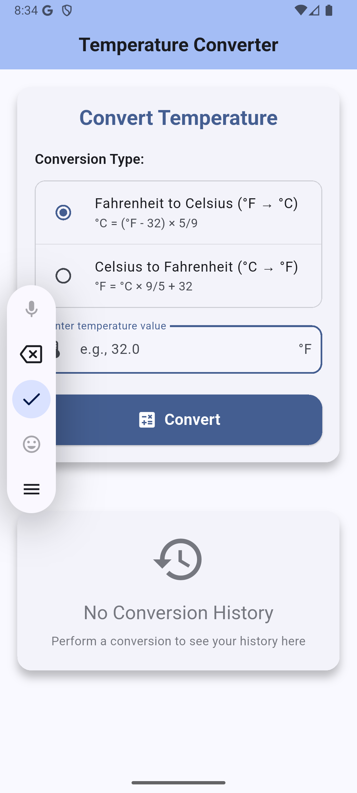

# Flutter Temperature Converter

This application is for converting temperatures between Fahrenheit and Celsius. It has the following features:
- An intuitive user interface
- Conversion history tracking
- Smooth animations.

[](https://flutter.dev/)
[](https://dart.dev/)

## Screenshots

| Main Screen | Conversion Result | History View |
|-------------|------------------|--------------|
|  |  |  |

## Features

### Core Functionality
- **Double Conversion**: Convert between Fahrenheit and Celsius
- **Responsive Design**: Optimized for both portrait and landscape orientations
- **Conversion History**: Display previous conversions
- **Input Validation**: Validation for only numeric input with decimal support and limitation to prevent negative temperatures below absolute zero (-273.15°C or -459.67°F)
- **Instant Results**: Direct conversion results with some smooth animation

### User Experience
- **Haptic Feedback**: Touch responses for enhanced user interaction
- **History Management**: Clear all conversions with confirmation dialog
- **Formatted Input**: Decimal number support with proper formatting

### Technical Features
- **Modular Architecture**: Well-organized codebase with separation of concerns
- **Custom Widgets**: Reusable components for maintainable code
- **Proper State Management**: Efficient state handling with StatefulWidget
- **Form Validation**: Strong input validation and error handling

## Getting Started

### Prerequisites

Before running this application, ensure you have the following installed:

- **Flutter SDK** (version 3.0.0 or higher)
- **Dart SDK** (version 3.0.0 or higher)
- **Android Studio** or **VS Code** with Flutter extensions
- **Android Emulator** or **iOS Simulator** (or physical device)

### Installation

1. **Clone the repository**
   ```bash
   git clone https://github.com/IrakozeLoraine/flutter-temperature-converter.git
   cd flutter-temperature-converter
   ```

2. **Install dependencies**
   ```bash
   flutter pub get
   ```

3. **Verify Flutter installation**
   ```bash
   flutter doctor
   ```

4. **Run the application**
   ```bash
   flutter run
   ```

## Architecture Overview

### Project Structure

```
lib/
├── main.dart                      # Application entry point
├── models/                        # Data models
│   └── conversion_history.dart    # Conversion history data model
├── constants/                     # Application constants
│   ├── conversion_type.dart       # Conversion type enum
│   └── conversion_formulas.dart   # Temperature conversion formulas
├── screens/                       # Application screens
│   └── temperature_converter_screen.dart  # Main conversion screen
├── widgets/                       # Reusable UI components
│   ├── conversion_card.dart       # Main conversion input widget
│   ├── result_card.dart          # Conversion result display
│   ├── history_section.dart      # Conversion history list
│   └── conversion_type_selector.dart  # Radio button selector (Fahrenheit/Celsius)
└── utils/                        # Utility functions and helpers
    ├── validators.dart           # Input validation logic
    └── animations.dart          # Animation helper functions
```

### Architecture Principles

#### **Separation of Concerns**
- **Models**: Handle data structures
- **Widgets**: Manage UI components
- **Utils**: Provide helper functions
- **Constants**: Store application-wide constants and enums

#### **State Management**
- Uses Flutter's built-in `StatefulWidget` for local state management
- Efficient state updates with `setState()`
- Animation state managed through `AnimationController`

## Core Components

### 1. Data Models

#### `ConversionHistory`
```dart
class ConversionHistory {
  final ConversionType type;
  final double inputValue;
  final double outputValue;
  final DateTime timestamp;
  
  // Computed properties for UI display
  String get inputUnit { ... }
  String get outputUnit { ... }
  String get formattedConversion { ... }
}
```

**Purpose**: Represents a single temperature conversion record used for display and tracking conversion history.

### 2. Core Widgets

#### `TemperatureConverterScreen`
**Location**: `lib/screens/temperature_converter_screen.dart`

The main application screen that handles all functionality:
- Manages application state
- Handles user interactions
- Coordinates animations
- Provides navigation and app bar

**Key Responsibilities**:
- State management for conversions and history
- Animation controller lifecycle management
- Form validation and error handling
- User feedback through SnackBars and haptic (touch) feedback

#### `ConversionCard`
**Location**: `lib/widgets/conversion_card.dart`

Primary input interface (form) for temperature conversions:
- Form validation and input handling
- Conversion type selection
- Temperature input field
- Convert button with validation triggers

#### `ResultCard`
**Location**: `lib/widgets/result_card.dart`

Displays conversion results with animations:
- Animated result presentation
- Clear input/output formatting
- Responsive scaling animations
- Material Design styling

#### `HistorySection`
**Location**: `lib/widgets/history_section.dart`

Manages conversion history display:
- Scrollable list of past conversions
- Empty state handling
- Formatting individual conversion item

### 3. Utility Functions

#### Temperature Conversion Formulas
```dart
// Fahrenheit to Celsius: °C = (°F - 32) × 5/9
double fahrenheitToCelsius(double fahrenheit) {
  return (fahrenheit - 32) * 5 / 9;
}

// Celsius to Fahrenheit: °F = °C × 9/5 + 32
double celsiusToFahrenheit(double celsius) {
  return celsius * 9 / 5 + 32;
}
```

#### Input Validation
- **Range Validation**: Prevents temperatures below absolute zero (-273.15°C or -459.67°F)
- **Format Validation**: Ensures numeric input with decimal support
- **Empty Input Handling**: Provides clear error message when input is empty
- **Immediate Feedback**: Validation results are instant

### 4. Animation System

#### Animation Controllers
- **Result Animation**: Elastic scale animation for conversion results
- **Lifecycle Management**: Proper initialization and disposal

#### Animation Curves
- `Curves.elasticOut`: Engaging bounce effect for results

## State Management

### State Structure

```dart
class _TemperatureConverterScreenState extends State<TemperatureConverterScreen> {
  // Form Management
  final TextEditingController _temperatureController;
  final GlobalKey<FormState> _formKey;
  
  // Application State
  ConversionType _selectedConversionType;
  double? _convertedValue;
  List<ConversionHistory> _conversionHistory;
  
  // Animation Controllers
  late AnimationController _resultAnimationController;
  late AnimationController _historyAnimationController;
}
```

### State Flow

1. **Input Phase**: User enters temperature and selects conversion type
2. **Validation Phase**: Input is validated for format and range (no negative temperatures below absolute zero)
3. **Conversion Phase**: Mathematical conversion is performed
4. **Update Phase**: State is updated with new result and history entry
5. **Animation Phase**: UI animations are triggered
6. **Feedback Phase**: Haptic (touch) feedback and visual updates are provided

## 🤝 Contributing

### Development Setup

1. Fork the repository
2. Create a feature branch: `git checkout -b feature/new-interesting-feature`
3. Commit changes: `git commit -m 'Add a new interesting feature'`
4. Push to branch: `git push origin feature/new-interesting-feature`
5. Open a Pull Request
